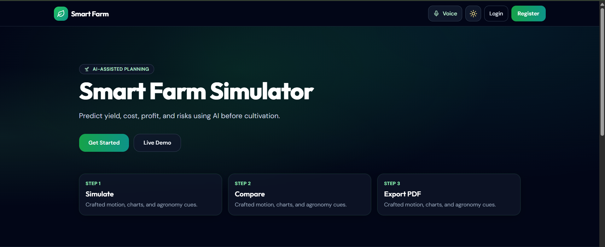
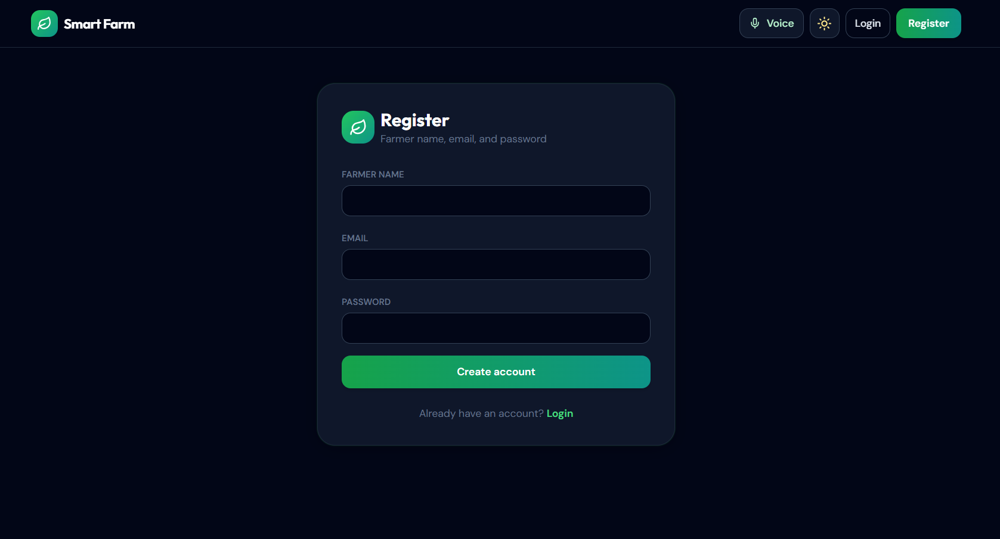
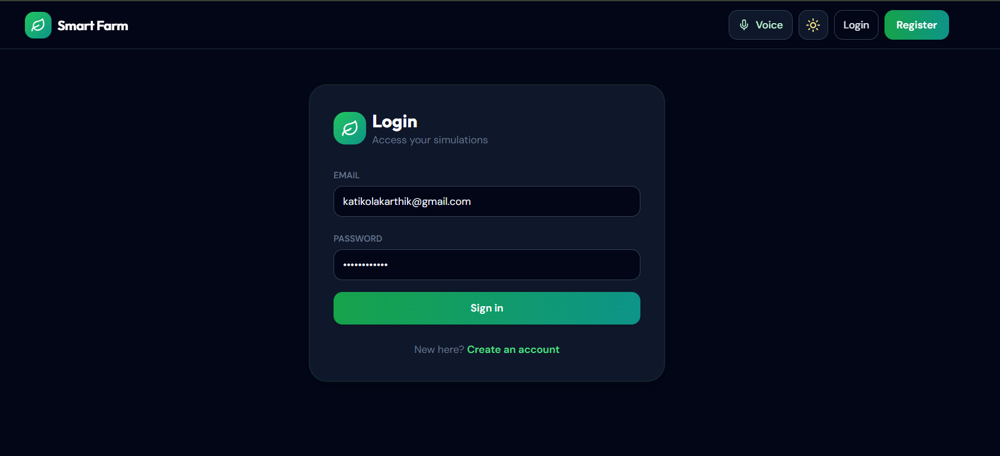
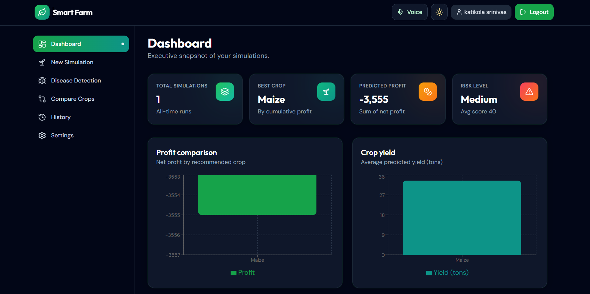
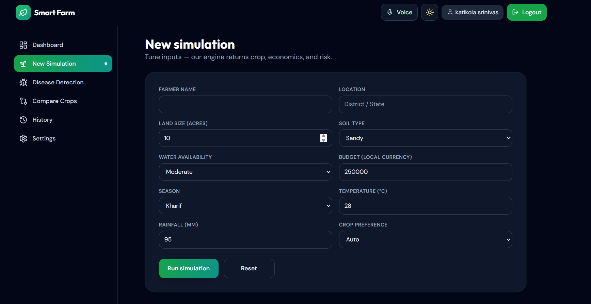
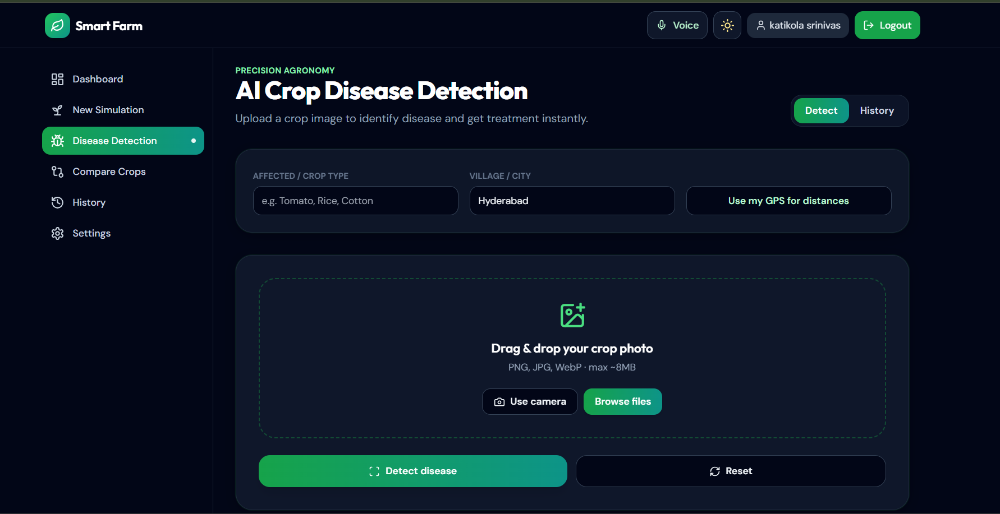
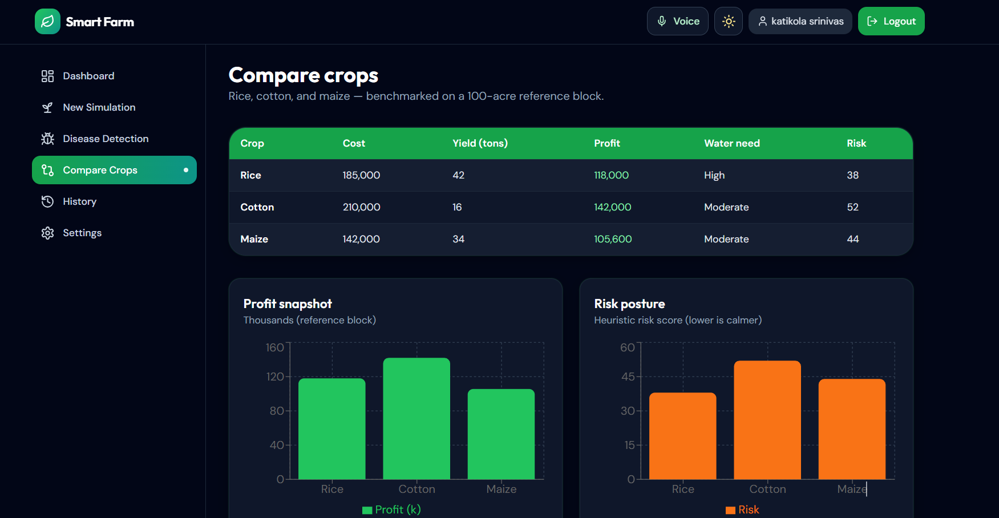
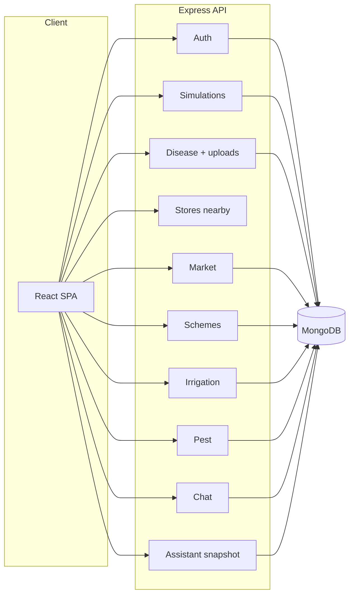

<p align="center">
  
</p>

<h1 align="center">Smart Farm Simulator</h1>

<p align="center"><strong>Full-stack agritech demo</strong> — simulate crops before you sow, export PDFs, run an AI-style disease workflow with maps & mock store routing, plus market outlooks, government scheme matching, irrigation planning, pest risk alerts, a dashboard assistant snapshot, and an in-app farming chat.</p>

<p align="center">
  <a href="https://nodejs.org/"></a>
  <a href="https://react.dev/"></a>
  <a href="https://vitejs.dev/"></a>
</p>

<p align="center">
  <a href="https://expressjs.com/"></a>
  <a href="https://www.mongodb.com/"></a>
  <a href="https://tailwindcss.com/"></a>
</p>

<p align="center">
  <a href="#demo-gallery">Gallery</a>
  &nbsp;·&nbsp;
  <a href="#highlights">Highlights</a>
  &nbsp;·&nbsp;
  <a href="#tech-stack">Stack</a>
  &nbsp;·&nbsp;
  <a href="#getting-started">Run locally</a>
  &nbsp;·&nbsp;
  <a href="#production-deployment">Deploy</a>
  &nbsp;·&nbsp;
  <a href="#api-reference">API</a>
</p>

---

## Demo gallery

<p align="center">
  <sub>Commit all files under <code>screenshots/</code> so images load on GitHub.</sub>
</p>

<table>
  <tr>
    <td width="50%" valign="top">
      
      <p align="center"><sub><b>2</b></sub></p>
    </td>
    <td width="50%" valign="top">
      
      <p align="center"><sub><b>3</b></sub></p>
    </td>
  </tr>
  <tr>
    <td valign="top">
      
      <p align="center"><sub><b>4</b></sub></p>
    </td>
    <td valign="top">
      
      <p align="center"><sub><b>5</b></sub></p>
    </td>
  </tr>
  <tr>
    <td valign="top">
      
      <p align="center"><sub><b>6</b></sub></p>
    </td>
    <td valign="top">
      
      <p align="center"><sub><b>7</b></sub></p>
    </td>
  </tr>
</table>

---

## Highlights

| Module | What it does |
|--------|----------------|
| **Farm simulator** | JWT auth, Mongo-backed simulations, dashboard charts (Recharts), compare crops, history, PDF export for runs |
| **Disease intelligence** | Image upload (multer), mock CV features + server rules, treatments, **Leaflet** map (always light tiles), mock nearby stores, disease PDF |
| **Market intelligence** | Mock mandi-style prices by crop & location, short-horizon “predictions”, trend series, buy/hold/sell-style recommendations (persisted per user) |
| **Government schemes** | Filter by state, land size, crop, farmer category; mock eligibility list with scheme cards (history saved in MongoDB) |
| **Irrigation planner** | Soil, weather, water source, and crop inputs produce a mock schedule, liters per window, drought-style warnings, and tips (plans persisted) |
| **Pest alerts** | Season + weather aware mock risk score, likely pests, prevention panel, and treatment notes (alerts persisted) |
| **Assistant & chat** | `GET /api/assistant/snapshot` aggregates simulations, last disease scan, market, irrigation, pest, and schemes for dashboard cards and chart seeds; floating **AI Farmer Assistant** chat with quick prompts and `POST /api/chat/message` (mock replies, history in DB) |
| **Presentation** | Public `/presentation` slide-style walkthrough for demos and pitch contexts |
| **Product UI** | Tailwind + agronomy greens, glass cards, Framer Motion, dark mode, i18n (EN · ES · HI · TE), toasts, responsive sidebar |

<details>
<summary><strong>Expand: feature checklist</strong></summary>

**Simulator:** landing · register/login · dashboard stat cards · profit / yield / climate charts · simulation form with loader · result cards + alternatives + fertilizers + pest warnings · crop compare (rice / cotton / maize) · simulation history · settings (language, theme, profile).

**Disease:** drag-drop & camera · detect + reset · severity badge · medicine cards + “how to apply” modal · store cards + navigate · voice summary (Web Speech) · scan history tab · GPS for distances.

**Market:** crop / state / district filters · current mock price · prediction with trend chart data and recommendation badge.

**Schemes:** eligibility-style recommendations from profile-like filters · scheme cards with badges.

**Irrigation:** inputs for crop, land, soil, weather, water source · timeline schedule · water cards · alert banner when mock drought logic fires.

**Pest:** risk meter · pest cards · prevention tips · server-side mock prediction pipeline.

**Chat:** global floating widget when logged in · quick actions · multilingual-aware replies (swap `server/utils/chatLogic.js` for a real LLM later).

**Dashboard extras:** assistant snapshot–driven stat strip and seeded Recharts for price trend, water usage, and pest risk history.

</details>

---

## Tech stack

| | |
|--|--|
| **Client** | React 18 · Vite 5 · Tailwind · Framer Motion · Recharts · react-leaflet · Leaflet · Lucide · axios · react-hot-toast · jsPDF |
| **Server** | Express 4 · Mongoose · Multer 2 · bcryptjs · JWT · CORS · dotenv |
| **Data** | MongoDB collections: `User`, `Simulation`, `DiseaseScan`, `MarketPrediction`, `SchemeHistory`, `IrrigationPlan`, `PestAlert`, `ChatHistory` |
| **“AI”** | Replaceable heuristics in `server/utils/predict.js`, `diseasePredict.js`, `marketLogic.js`, `schemesLogic.js`, `irrigationLogic.js`, `pestLogic.js`, `chatLogic.js` |

---

## Architecture



---

## Getting started

**Requirements:** Node.js **≥ 18** · **MongoDB** (local or Atlas)

```bash
git clone https://github.com/YOUR_USERNAME/YOUR_REPO.git
cd YOUR_REPO
```

**Terminal 1 — API**

```bash
cd server
cp .env.example .env
# Set MONGODB_URI, JWT_SECRET (and CLIENT_ORIGIN if needed)
npm install
npm run dev
```

**Terminal 2 — UI**

```bash
cd client
npm install
npm run dev
```

Open **http://localhost:5173** (Vite proxies `/api` and `/uploads` to port **5000** by default).

**Production UI**

```bash
cd client && npm run build && npm run preview
```

---

## Production deployment

Live UI example: [sparcx-aethronix.vercel.app](https://sparcx-aethronix.vercel.app/). The static Vercel build does **not** include the Express server, so the browser must call your API on its own public URL.

### 1. Backend (any Node host: Render, Railway, Fly.io, VPS, …)

1. Create a **Web Service** (or equivalent) pointing at this repo with **root directory** `server` (or run commands from `server/`).
2. **Install:** `npm install` · **Start:** `npm start` (uses `process.env.PORT` automatically on most hosts).
3. Set environment variables on the host:

| Variable | Example / notes |
|----------|------------------|
| `MONGODB_URI` | [MongoDB Atlas](https://www.mongodb.com/cloud/atlas) connection string (`mongodb+srv://…`) |
| `JWT_SECRET` | Long random string (same secret across deploys so existing tokens stay valid, or plan a logout) |
| `CLIENT_ORIGIN` | `https://sparcx-aethronix.vercel.app` — CORS for your Vercel app. Comma-separated values are supported for preview URLs. |
| `PORT` | Optional; many platforms inject this |

4. In **Atlas → Network Access**, allow your host’s egress IPs or `0.0.0.0/0` for a demo (tighten for production).

**Ephemeral disk:** disease images are stored under `uploads/` on the server filesystem. On typical PaaS free tiers the disk is wiped on redeploy or sleep; for durable images use object storage (S3, R2, etc.) and return full URLs from upload logic later.

### 1b. Backend on Vercel (Express preset)

Vercel’s **Express** integration looks for `server/index.js` and expects a **default export** of the Express `app` (see [Express on Vercel](https://vercel.com/docs/frameworks/backend/express)). This repo’s `index.js` does that when `VERCEL` is set, and uses `app.listen` only for local / non-Vercel runs. Do **not** add a competing `vercel.json` rewrite to `/api` unless you follow Vercel’s older serverless-function layout.

1. **Root Directory** → **`server`**.
2. **Framework preset** → **Express** (or “Other” with Node; Express is fine).
3. **Environment variables**: `MONGODB_URI`, `JWT_SECRET`, `CLIENT_ORIGIN` (frontend URL, **no trailing slash** recommended, e.g. `https://sparcx-aethronix.vercel.app`).
4. Push changes and **Redeploy**.
5. Open `https://YOUR-API.vercel.app/api/health` — should return `{"ok":true,...}` without needing a successful DB call (health is registered before the Mongo middleware).

Per Vercel, `express.static()` is not used for CDN assets the same way as on a VPS; disease uploads on Vercel still use **`/tmp`**. For durable files, use Render/Railway or object storage.

### 2. Frontend (Vercel)

1. In the Vercel project → **Settings → Environment Variables**, add:

| Name | Value |
|------|--------|
| `VITE_API_ORIGIN` | Your API base URL **without** a trailing slash, e.g. `https://smart-farm-api.onrender.com` |

2. **Redeploy** the site so Vite bakes this value into the build (`import.meta.env.VITE_API_ORIGIN`).

Locally, leave `VITE_API_ORIGIN` unset so `/api` and `/uploads` keep using the Vite dev proxy.

---

## Environment (`server/.env`)

| Key | Purpose |
|-----|---------|
| `PORT` | API port (default `5000`; PaaS usually overrides) |
| `MONGODB_URI` | Mongo connection string |
| `JWT_SECRET` | Secret for signing tokens |
| `CLIENT_ORIGIN` | Frontend origin(s) for CORS (e.g. `http://localhost:5173` or `https://sparcx-aethronix.vercel.app`). Comma-separated for multiple origins. |

### Frontend build (`client/.env` or Vercel env)

| Key | Purpose |
|-----|---------|
| `VITE_API_ORIGIN` | Production API origin only (no `/api` suffix, no trailing slash). Copy from `client/.env.example`. |

---

## API reference

<details>
<summary><strong>Auth —</strong> <code>/api/auth</code></summary>

| Method | Path | Body / notes |
|--------|------|----------------|
| POST | `/register` | `name`, `email`, `password` |
| POST | `/login` | `email`, `password` |
| PATCH | `/profile` | Bearer JWT · `name` |

</details>

<details>
<summary><strong>Simulations —</strong> <code>/api/simulations</code> (JWT)</summary>

| Method | Path | Notes |
|--------|------|--------|
| POST | `/create` | Full simulation payload |
| GET | `/all` | User’s runs |
| GET | `/:id` | One document |

</details>

<details>
<summary><strong>Disease —</strong> <code>/api/disease</code> (JWT)</summary>

| Method | Path | Notes |
|--------|------|--------|
| POST | `/upload` | `multipart/form-data`, field name **`image`** |
| POST | `/detect` | JSON: `imageUrl`, `features`, optional geo + `cropType` |
| GET | `/history` | All scans |
| GET | `/:id` | One scan |

</details>

<details>
<summary><strong>Stores —</strong> <code>/api/stores</code> (JWT)</summary>

| Method | Path | Query |
|--------|------|--------|
| GET | `/nearby` | `lat`, `lng`, `city`, `medicine` (comma-separated) |

</details>

<details>
<summary><strong>Market —</strong> <code>/api/market</code> (JWT)</summary>

| Method | Path | Notes |
|--------|------|--------|
| GET | `/prices` | Query: `crop`, `state`, `district` — mock current price |
| POST | `/predict` | Body: `crop`, `state`, `district` — saves `MarketPrediction` |

</details>

<details>
<summary><strong>Schemes —</strong> <code>/api/schemes</code> (JWT)</summary>

| Method | Path | Body |
|--------|------|------|
| POST | `/recommend` | `state`, `landSize`, `cropType`, `farmerCategory` — saves `SchemeHistory` |

</details>

<details>
<summary><strong>Irrigation —</strong> <code>/api/irrigation</code> (JWT)</summary>

| Method | Path | Body |
|--------|------|------|
| POST | `/plan` | Crop, land, soil, weather, water source, etc. (see `buildIrrigationPlanMock`) — saves `IrrigationPlan` |

</details>

<details>
<summary><strong>Pest —</strong> <code>/api/pest</code> (JWT)</summary>

| Method | Path | Body |
|--------|------|------|
| POST | `/predict` | `crop`, `location`, `season`, `weather` — saves `PestAlert` |

</details>

<details>
<summary><strong>Chat —</strong> <code>/api/chat</code> (JWT)</summary>

| Method | Path | Body |
|--------|------|------|
| POST | `/message` | `message`, optional `lang` — saves `ChatHistory`, returns `response` and `id` |

</details>

<details>
<summary><strong>Assistant —</strong> <code>/api/assistant</code> (JWT)</summary>

| Method | Path | Notes |
|--------|------|--------|
| GET | `/snapshot` | Aggregates latest simulations, disease, market, irrigation, pest, schemes for dashboard cards and small chart datasets |

</details>

**Health:** `GET /api/health` · **Static uploads:** `GET /uploads/...`

---

## Repository layout

```
├── client/          # Vite + React (pages: market, schemes, irrigation, pest; chat widget; voice STT helper)
├── server/          # Express (extra routes: market, schemes, irrigation, pest, chat, assistant + matching models)
├── screenshots/     # README images (keep in git for GitHub preview)
├── README.md
└── .gitignore
```

---

## Notes for reviewers

- **JWT** stored client-side; API routes use `Authorization: Bearer <token>`.
- **Disease uploads** write to `server/uploads/disease/` (ignored by git — create folder on deploy).
- **Axios:** no global `Content-Type: application/json` so **FormData** uploads work.
- **Map:** OSM raster tiles; light style even when the app theme is dark.
- **Market, schemes, irrigation, pest, and chat** endpoints use deterministic mock logic suitable for demos; swap the `server/utils/*Logic.js` modules (or wire external APIs) for production accuracy.

---

## Scripts

| Folder | Command | Use |
|--------|---------|-----|
| `server/` | `npm run dev` | Dev API (`node --watch`) |
| `server/` | `npm start` | Prod API |
| `client/` | `npm run dev` | Vite dev |
| `client/` | `npm run build` | Static build |
| `client/` | `npm run preview` | Serve `dist/` locally |

---

<p align="center">
  <sub>Evaluation / portfolio project — swap mock logic for real ML & maps APIs when you scale.</sub>
  <br /><br />
  <sub>If this README was useful, leaving a star helps others find the repo.</sub>
</p>
