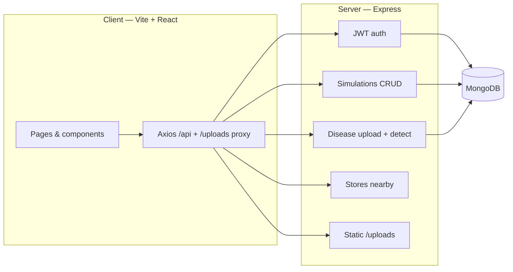

<div align="center">

# Smart Farm Simulator

**AI-powered farming simulation + crop disease intelligence — test strategies, predict economics, and triage field issues before you cultivate.**

[](https://nodejs.org/)
[](https://react.dev/)
[](https://vitejs.dev/)
[](https://expressjs.com/)
[](https://www.mongodb.com/)
[](https://tailwindcss.com/)

[Features](#-features) · [Screenshots](#-screenshots) · [Architecture](#-architecture) · [API](#-rest-api) · [Quick start](#-quick-start) · [Project structure](#-project-structure)

</div>

---

## Why this project

Smart Farm Simulator is a **full-stack** web application for farmers and agritech demos. It combines:

1. **Yield & economics simulation** — rule-based “AI” predicts crop, yield, cost, revenue, profit, and risk from soil, water, climate, and budget inputs (designed to be swapped for real ML later).
2. **AI Crop Disease Detection** — upload leaf/crop photos, get mock vision-based disease labels, treatment plans, **PDF reports**, and **nearby agri-store** suggestions with an **interactive Leaflet map** (light tiles in all themes).

The UI is **premium**: green agronomy palette, glass-style cards, **Framer Motion** transitions, **Recharts** dashboards, **dark mode**, **multi-language** (EN / ES / HI / TE), toasts, and responsive **sidebar + navbar** layout.

---

## Features

### Core simulator

| Area | Details |
|------|--------|
| **Landing** | Hero, CTAs, feature cards, testimonials, footer |
| **Auth** | Register / login with JWT, bcrypt-hashed passwords |
| **Dashboard** | Summary cards, profit/yield/climate charts from MongoDB history |
| **New simulation** | Full form + overlay loader + persistence |
| **Results** | Rich cards, alternatives, fertilizers, pest alerts, **export simulation PDF** |
| **Compare crops** | Rice, cotton, maize — tables + charts |
| **History** | All simulations for the logged-in user |
| **Settings** | Language, theme, profile (PATCH name) |

### Disease detection module

| Area | Details |
|------|--------|
| **Upload** | Drag & drop, camera (`capture`), image preview |
| **Analysis** | Client-side image features + server mock classifier → disease, confidence, severity, cause, prevention |
| **Treatment** | Medicine cards with usage, spray method, duration, safety, price; **“How to apply”** modal |
| **Stores** | Mock stores with distance, hours hint, phone, **Navigate** (Google Maps) |
| **Map** | **react-leaflet** + OSM tiles — always **light** map for readability; fit bounds to pins |
| **Extras** | Voice summary (`speechSynthesis`), save/history tab, disease **PDF**, GPS for distances |

---

## Screenshots

> Add or replace images in `screenshots/` — these paths work on GitHub when files are committed.

<table>
  <tr>
    <td width="50%">
      
      <p align="center"><sub><b>1</b> — Landing / hero / first impression</sub></p>
    </td>
    <td width="50%">
      
      <p align="center"><sub><b>2</b> — Auth or dashboard overview</sub></p>
    </td>
  </tr>
  <tr>
    <td>
      
      <p align="center"><sub><b>3</b> — Simulation or analytics view</sub></p>
    </td>
    <td>
      
      <p align="center"><sub><b>4</b> — Results / charts / cards</sub></p>
    </td>
  </tr>
  <tr>
    <td>
      
      <p align="center"><sub><b>5</b> — Disease detection workflow</sub></p>
    </td>
    <td>
      
      <p align="center"><sub><b>6</b> — Map & nearby stores</sub></p>
    </td>
  </tr>
  <tr>
    <td colspan="2">
      
      <p align="center"><sub><b>7</b> — History, settings, or mobile layout</sub></p>
    </td>
  </tr>
</table>

---

## Architecture



---

## Tech stack

| Layer | Technologies |
|--------|----------------|
| **Frontend** | React 18, Vite 5, Tailwind CSS, Framer Motion, Recharts, react-leaflet, Leaflet, Lucide icons, react-hot-toast, jsPDF |
| **Backend** | Node.js 18+, Express 4, Mongoose 8, Multer 2, bcryptjs, jsonwebtoken, cors, dotenv |
| **Database** | MongoDB (users, simulations, disease scans) |
| **AI (mock)** | Rule-based prediction in `server/utils/predict.js` + `diseasePredict.js` — replace with real models / APIs when ready |

---

## REST API

### Auth (`/api/auth`)

| Method | Path | Description |
|--------|------|-------------|
| `POST` | `/register` | Body: `name`, `email`, `password` → JWT + user |
| `POST` | `/login` | Body: `email`, `password` → JWT + user |
| `PATCH` | `/profile` | Bearer JWT — update `name` |

### Simulations (`/api/simulations`) — Bearer JWT

| Method | Path | Description |
|--------|------|-------------|
| `POST` | `/create` | Create simulation from form payload |
| `GET` | `/all` | List user’s simulations |
| `GET` | `/:id` | Get one simulation |

### Disease (`/api/disease`) — Bearer JWT

| Method | Path | Description |
|--------|------|-------------|
| `POST` | `/upload` | `multipart/form-data`, field **`image`** (JPEG/PNG/WebP) |
| `POST` | `/detect` | JSON: `imageUrl`, `features`, optional `cropType`, `latitude`, `longitude`, `city` |
| `GET` | `/history` | List disease scans |
| `GET` | `/:id` | Get one scan |

### Stores (`/api/stores`) — Bearer JWT

| Method | Path | Description |
|--------|------|-------------|
| `GET` | `/nearby` | Query: `lat`, `lng`, `city`, `medicine` (comma-separated) |

### Other

| Method | Path | Description |
|--------|------|-------------|
| `GET` | `/api/health` | API heartbeat |
| `GET` | `/uploads/...` | Served static files for uploaded disease images |

---

## Quick start

### Prerequisites

- **Node.js** ≥ 18  
- **MongoDB** running locally or a connection string (Atlas, etc.)

### 1. Clone & install

```bash
git clone https://github.com/<YOUR_USERNAME>/aethronix.git
cd aethronix
```

**Server**

```bash
cd server
cp .env.example .env
# Edit .env — set MONGODB_URI and JWT_SECRET (and optional CLIENT_ORIGIN)
npm install
npm run dev
```

**Client** (second terminal)

```bash
cd client
npm install
npm run dev
```

Open **http://localhost:5173** — Vite proxies `/api` and `/uploads` to the API (default `http://localhost:5000`).

### 2. Environment variables (`server/.env`)

| Variable | Example | Purpose |
|----------|---------|---------|
| `PORT` | `5000` | API port |
| `MONGODB_URI` | `mongodb://127.0.0.1:27017/smart_farm_simulator` | Database |
| `JWT_SECRET` | long random string | Sign JWTs |
| `CLIENT_ORIGIN` | `http://localhost:5173` | CORS |

### 3. Production build (client)

```bash
cd client
npm run build
npm run preview   # optional local preview of dist/
```

Serve `client/dist` with any static host and point API `CLIENT_ORIGIN` to your frontend URL.

---

## Project structure

```
aethronix/
├── client/                 # React + Vite SPA
│   ├── public/
│   ├── src/
│   │   ├── api/            # Axios instance
│   │   ├── components/     # Layout, disease/*, charts, forms…
│   │   ├── context/        # Auth, theme, language
│   │   ├── i18n/
│   │   ├── pages/
│   │   └── utils/          # imageFeatures, PDF exports
│   ├── index.html
│   ├── package.json
│   ├── tailwind.config.js
│   └── vite.config.js
├── server/                 # Express API
│   ├── models/             # User, Simulation, DiseaseScan
│   ├── routes/             # auth, simulations, disease, stores
│   ├── middleware/
│   ├── utils/              # predict.js, diseasePredict.js, mockStores.js
│   ├── index.js
│   ├── package.json
│   └── .env.example
├── screenshots/            # README gallery (commit PNGs here)
└── README.md
```

---

## Notes for evaluators

- **Authentication**: JWT in `localStorage`; protected routes on the client; `requireAuth` on protected API routes.
- **File uploads**: Disease images land under `server/uploads/disease/` (add `uploads/` to `.gitignore`; not committed by default).
- **“AI”**: Heuristic / rule-based logic only — suitable for demos and UI/UX evaluation; clearly separated in `server/utils/` for future ML integration.
- **Axios**: Do not set a global `Content-Type: application/json` header so `FormData` uploads work for disease images.

---

## Scripts reference

| Location | Command | Purpose |
|----------|---------|---------|
| `server/` | `npm run dev` | API with `--watch` |
| `server/` | `npm start` | API production mode |
| `client/` | `npm run dev` | Vite dev server |
| `client/` | `npm run build` | Production bundle |
| `client/` | `npm run preview` | Preview `dist/` |

---

## License

This repository is intended for **portfolio / coursework / evaluation**. Add a `LICENSE` file if you want explicit terms (e.g. MIT).

---

<div align="center">

**Built with discipline — mock intelligence today, real models tomorrow.**

⭐ If this README helped your review, a star on the repo is appreciated.

</div>
# sparcx_Aethronix

